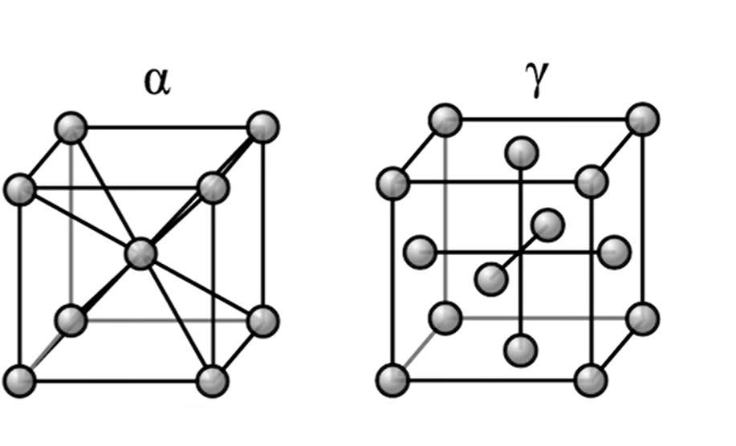
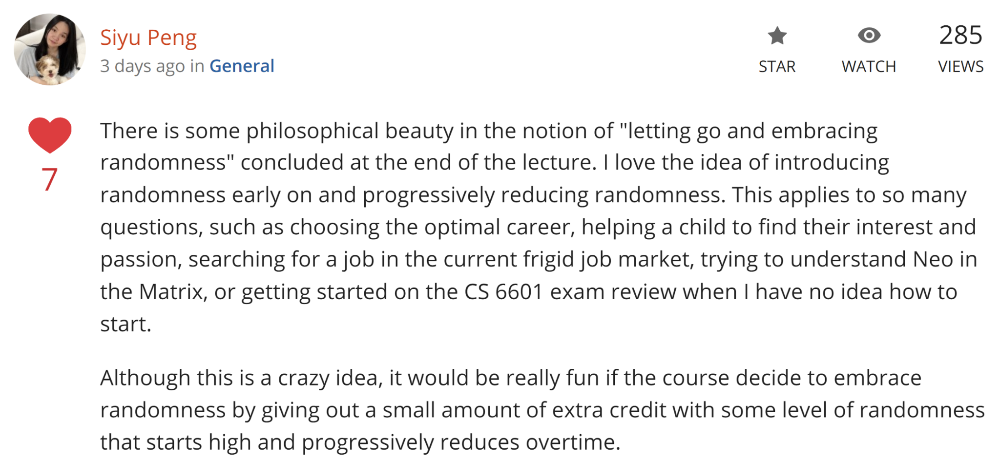

# Chapter 4- Search in Complex Environments

**Overview:** Search algorithms for problems in partially observable,
nondeterministic, unknown, and continuous environments

Readings:
- AIMA: Chapter 4.1
- Further information: Chapter 4.2-4.5
- For another viewpoint and some extensions, check out Charles Isbell and
Michael Littman's Machine Learning course section on this topic:
[Randomized
Optimization](https://classroom.udacity.com/courses/ud741/lessons/521298714/concepts/5344086080923)

Other Resources:
- [R&N slides on Beyond
Search](http://www.cc.gatech.edu/~thad/6601-gradAI-fall2015/chapter04b.pdf)
- [ubalklen /
Artificial-Intelligence-Course-Notes//optimization.md](https://github.com/ubalklen/Artificial-Intelligence-Course-Notes/blob/master/optimization.md)
- [UC Berkeley: CS 188- Note 2: CSPs, Local
Search](https://inst.eecs.berkeley.edu/~cs188/su22/assets/notes/n2_su22.pdf)
- [CS50 AI- Lecture 3-
Optimization](https://cs50.harvard.edu/ai/2020/notes/3/)

# Local Search and Optimization Problems

**Local search** methods work through iterative improvement, moving to
neighboring states while maintaining only a small number of states in
memory. Local search can solve **optimization problems**, where the goal
is to find the best state according to an objective function, without
worrying about the path to the state.

In a **state-space landscape**, when the value of the objective function
corresponds to elevation, the aim is to find the highest peak- a
**global maximum**- using hill climbing. If elevation corresponds to
cost, **gradient descent** is used to find the lowest value- a **global
minimum**.

## Hill-Climbing Search

*"Like climbing to the top of Mount Everest in a thick fog with
amnesia"*

The hill-climbing search algorithm iteratively moves from the current
state to the neighboring state in the direction of steepest ascent
(highest objective value). It terminates when it reaches a "peak" where
all neighbors have lower value than the current state.

Hill climbing is sometimes called **greedy local search** because it
grabs a good neighbor state without thinking ahead about where to go
next. It can rapidly progress towards a solution because it's usually
quite easy to improve a bad state. For example, for the following
N-queens problem with 4 queens, it takes just 2 steps to arrive at a
solution:

In fact, local search appears to run in constant time and almost always
solves n-queens instantaneously with very large n (e.g. 1 million).

However, the "greediness" of hill climbing makes it vulnerable to
getting stuck due to **local maxima,** which are peaks compared to
neighboring states but not the global maximum, as well as **plateaus,**
flat areas in the state-space landscape that can be flat local maxima
with no uphill exit, or **shoulders**, which may go up at some point.

For the [[Eight Queens
Puzzle]](https://en.wikipedia.org/wiki/Eight_queens_puzzle),
when starting from a randomly generated 8-queens state, hill climbing
gets stuck 86% of the time. Considering a state space with 8^8^ = 17
million states, the algorithm works quickly, averaging 4 steps when it
succeeds and 3 when stuck.

To solve more problems, we can approach the plateau issue by allowing
random sideways moves in the case of a shoulder, but this would cause an
infinite loop on a flat local maximum. Limiting the number of
consecutive sideways (e.g. 100) can improve the percentage of successful
instances from 14% to 94%, but at the cost of more iterations (i.e. 21
for successes and 64 for failures).

Variants of hill climbing have been proposed:

-   **Stochastic hill climbing**: chooses neighbors at random from
    uphill moves with a probability that varies with their steepness.
    This usually converges more slowly but may converge to higher maxima
    (e.g. the highest-valued neighbor leads to a local maximum while
    another neighbor leads to a global maximum).

-   **First-choice hill climbing:** Implements stochastic hill climbing
    by randomly generating successors and choosing the first one that is
    better than the current state. This is a good strategy when a state
    has many (e.g. 1000s) of successors.

-   **Random-restart hill climbing:** conducts hill climbing multiple
    times, each starting from a random

-   state, and selects the highest maxima among the trials. It is
    trivially complete as it will eventually generate a goal state as
    the initial state.

[The success of hill-climbing depends very much on the shape of the
state-space landscape: if there are few local maxima and plateaus,
random-restart hill climbing will find a good solution very quickly. On
the other hand, many real problems have a more complex landscape.
NP-hard problems typically have an exponential number of local maxima to
get stuck on.]{.mark}

## Simulated Annealing

*"Like getting a ping-pong ball into the deepest crevice in a very bumpy
surface...by shaking hard and gradually reducing the intensity of the
shaking"*

Hill climbing by itself is vulnerable to local maxima, while random
walking, which randomly chooses neighbors, will eventually stumble upon
the global maximum but is extremely inefficient. Simulated annealing is
a stochastic local search algorithm that aims to combine hill climbing
with random walking to yield efficiency and completeness, allowing the
algorithm to "dislodge" itself if it gets stuck in a local maximum.

In metallurgy, **annealing** is the process of heating metals and glass
and gradually cooling them, thus allowing the material to reach a low
energy crystalline state. In simulated annealing, we switch our point of
view from hill climbing to gradient descent (i.e. minimizing cost) and
probabilistically allow worse moves. The algorithm at each state picks a
random move, rather than the best move. Better moves are always accepted
but worse moves are accepted with a probability determined by the
"temperature" T, which is initially high and decreases according to some
schedule. If the schedule lowers T to 0 slowly enough, the algorithm
will reach the global maximum with probability approaching 1.

## Local Beam Search

**Local beam search** starts with *k* randomly generated states and
generates all of their successors. The algorithm halts if the goal is
found; otherwise it selects the *k* best successors and repeats. It can
suffer from lack of diversity among the *k* states, however (often all
*k* states end up on the same local hill).

The **stochastic beam search** variant increases diversity by choosing
*k* successors randomly biased towards good ones, analogous to natural
selection.

## Evolutionary Algorithms

**Evolutionary algorithms** are variants of stochastic beam search that
are explicitly motivated by the metaphor of natural selection in
biology: a population of individuals (states) is maintained in which and
the process of **recombination** in which the next generation is
generated by the fittest individuals producing offspring (successor
states). In **genetic algorithms**, individuals are represented by a
string analogous to the DNA string 'ACGT'.

-   Random restart, genetic algorithms, and simulated annealing are
    combined into the idea of stochastic beam search

    -   Where multiple particles are released on the graph

    -   And their children generate progressively less randomly

    -   And eventually converge to the maximum value

-   We\'ll see these techniques repeatedly in AI

    -   In techniques like particle filters, hand recognition w/ hidden
        markov models, and monte carlo markov chains

    -   Keep these algorithms in mind whenever ur creating ur own
        algorithms or tackling new problems

    -   Sometimes letting go and embracing randomness is the key to the
        solution
